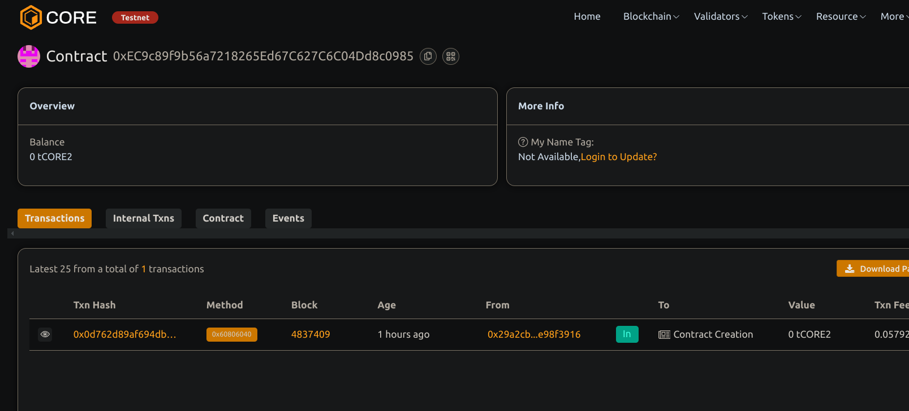

  # 🏛️ DAO Framework                       
        
## 🧠 Project Description

A basic DAO framework allowing members to create proposals, vote on them, and execute them based on majority consensus.
           
## 🌍 Project Vision               

To enable decentralized governance for any community or protocol by providing a minimal and extendable DAO foundation.
            
## 🔑 Key Features

- Member-based access control
- Proposal creation with description
- One-member-one-vote system
- Execution based on majority voting
- Admin role for adding members

## 🚀 Future Scope

- Token-based voting
- Quorum and voting duration
- Role-based permissions (e.g., proposer, voter)
- Off-chain voting snapshots
- Treasury integration for fund management     

## 📜 Deployment Instructions

```bash 
npm install
npx hardhat compile
npx hardhat run scripts/deploy.js --network <your_network>
```

## Contract details
0xEC9c89f9b56a7218265Ed67C627C6C04Dd8c0985

